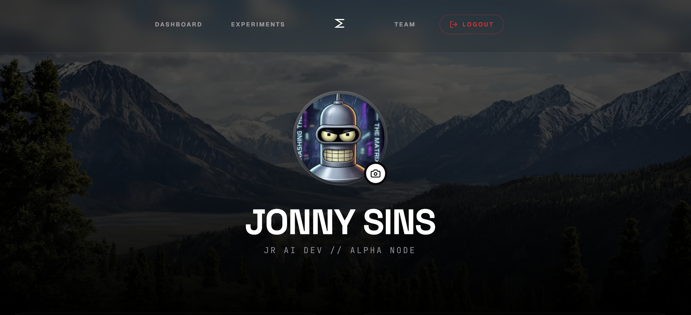
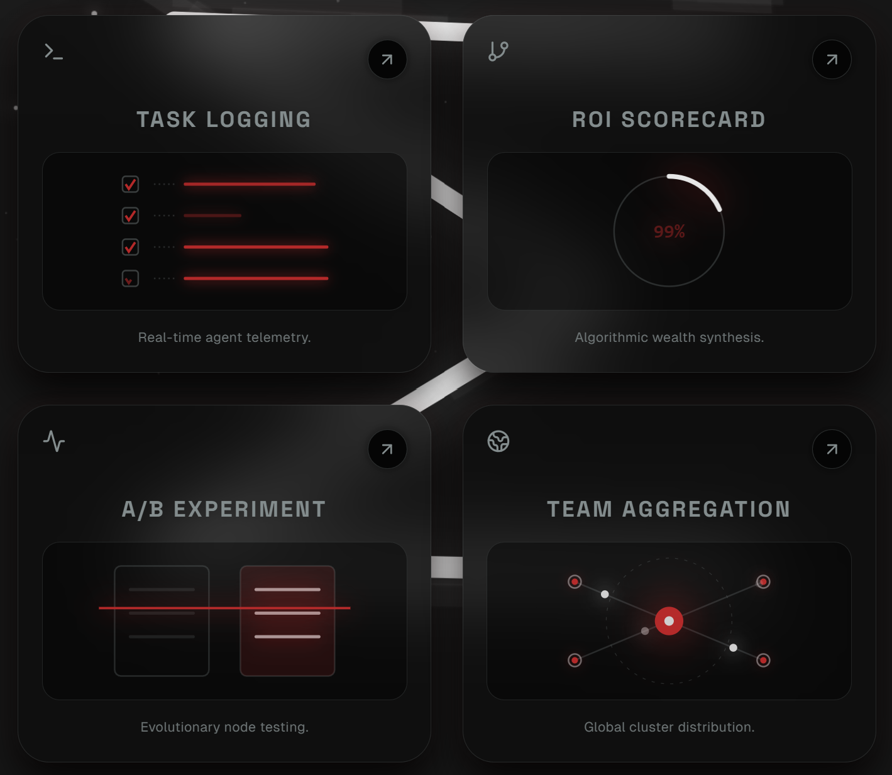
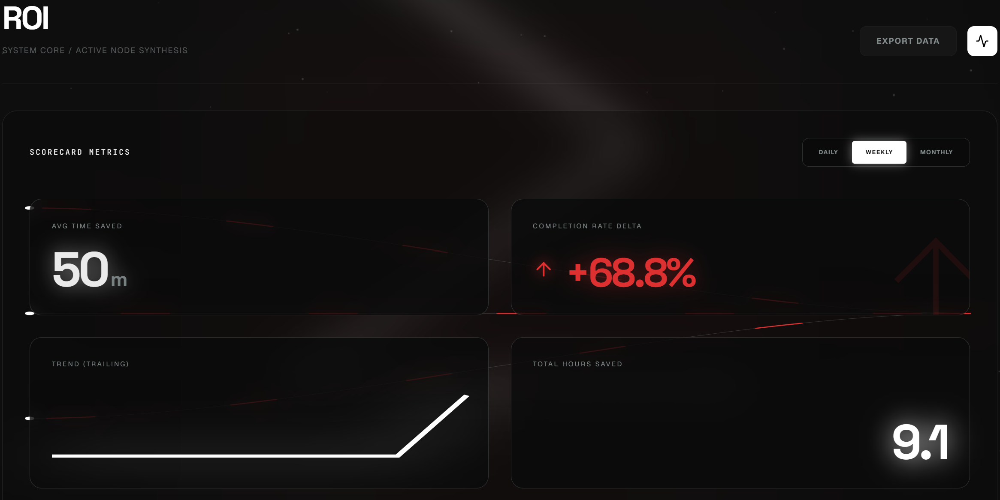
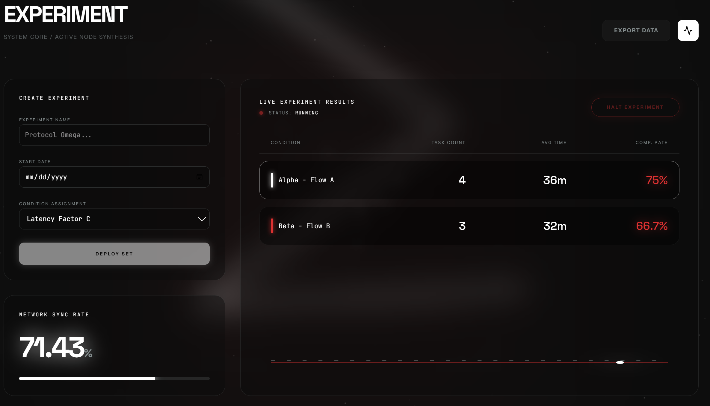
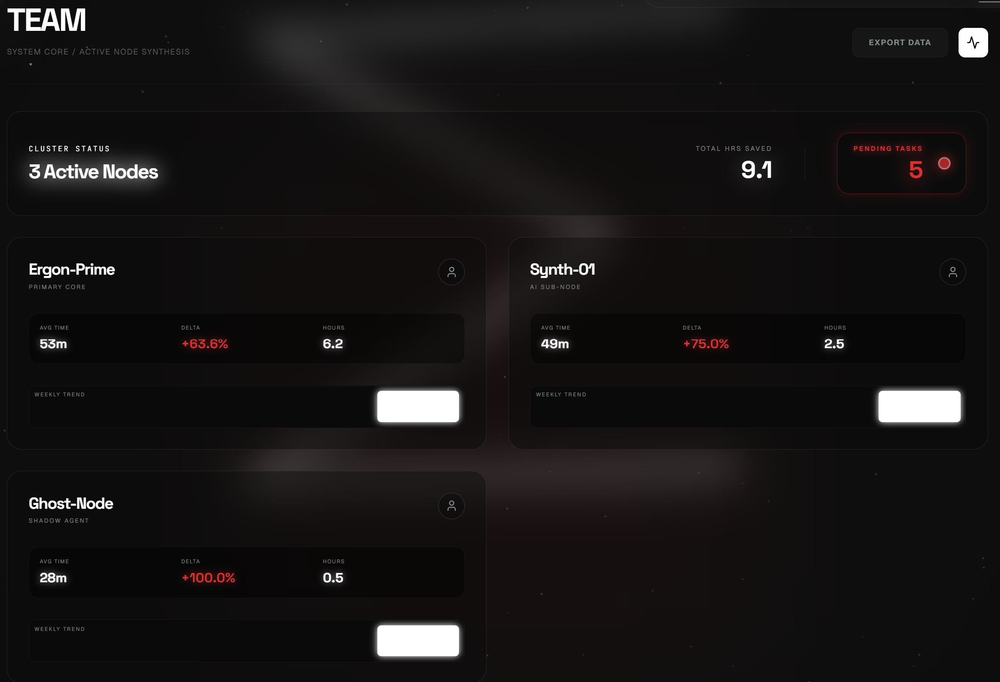
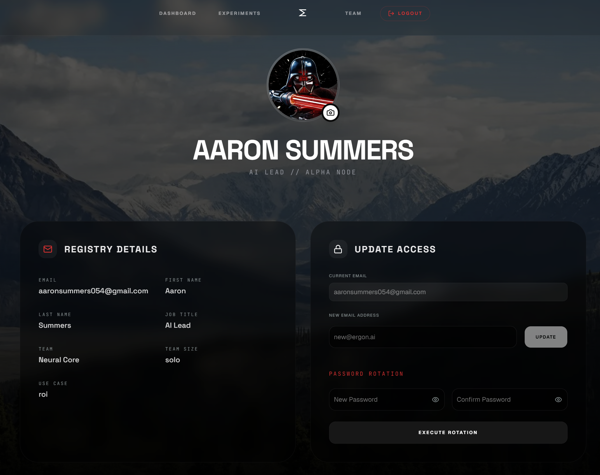

<div align="center">

# ⬡ ERGON

### AI Agent ROI Tracker


*Every Agent. Measured.*

---

<!-- Replace with actual hero screenshot -->


</div>

---

## 🔍 What This Is

Ergon is a full-stack SaaS dashboard that tracks the ROI of AI agents and human workers side by side — turning every logged task into a measurable efficiency signal. It surfaces real-time benchmarks across time saved, completion rate deltas, and A/B experiment outcomes so you always know which nodes in your intelligent network are actually delivering value. Built as an MVP with production-grade auth, row-level security, and a live analytics pipeline.

---

## 🚀 Live Demo

**[→ ergon.vercel.app](https://ergon-peach.vercel.app/)**

> Create a free account to explore all four dashboards with your own data.

---

## 🧭 Dashboard Overview

Four purpose-built tools, one command center.

<!-- Replace with actual tool grid screenshot -->


| Tool | Icon | Purpose |
|------|------|---------|
| **Logging** | 📋 | Log tasks by agent node, priority, and mode |
| **ROI** | 📊 | Scorecard metrics with period-over-period benchmarks |
| **Experiment** | 🧪 | A/B framework for condition-based task routing |
| **Team** | 👥 | Per-node performance with weekly trend charts |

---

## 📊 The 4 ROI Metrics

<!-- Replace with actual ROI view screenshot -->


| Metric | Formula | Why It Matters |
|--------|---------|----------------|
| **Avg Time Saved** | `Σ time_mins of COMPLETED tasks ÷ completed count` | Reveals the real throughput gain per task across your agent network |
| **Completion Rate Delta** | `current_period_rate − previous_period_rate` | Tracks momentum — whether your agents are improving or regressing week over week |
| **Total Hours Saved** | `Σ time_mins (COMPLETED) ÷ 60` | Translates raw task data into business-legible time reclaimed |
| **Trend (Trailing)** | Daily task-completion count over selected period | Visualizes cadence so you can spot drops before they compound |

Period granularity: **Daily · Weekly · Monthly** — switchable in one click.

---

## 🧪 A/B Framework

<!-- Replace with actual Experiment view screenshot -->


Deploy an experiment, assign tasks to conditions, and let the data decide.

**How it works:**
1. **Create** an experiment with a name, start date, and condition assignment (`Latency Factor C`, `Yield Threshold`, `Strict Mode`)
2. **Link tasks** to a condition when logging — tasks accumulate under `Alpha - Flow A` or `Beta - Flow B`
3. **Read results** live: task count, avg completion time, and completion rate per condition
4. **Halt / Resume** the experiment protocol at any time

**What to measure:** Which agent routing strategy completes tasks faster? Which condition yields higher completion rates? Does strict mode reduce latency or introduce friction?

The **Network Sync Rate** indicator shows the aggregate completion rate across all experiment-linked tasks as a single headline number.

---

## 👥 Team Dashboard

<!-- Replace with actual Team view screenshot -->


Every agent node gets its own performance card.

**What it shows per node:**
- **Avg Time** — mean completion time across finished tasks
- **Delta** — week-over-week completion rate change (`+/-`)
- **Hours** — total hours reclaimed by that node
- **Weekly Trend** — 5-day animated bar chart

**How aggregation works:** All tasks in the `tasks` table are grouped by `node_assign` (`Ergon-Prime`, `Synth-01`, `Ghost-Node`). Stats are computed client-side from the raw rows — no pre-aggregated views needed. The cluster header shows total active nodes, total hours saved (all nodes combined), and a live pending task count with a pulsing indicator.

---

## 👤 Account & Auth

<!-- Replace with actual Account page screenshot -->


| Feature | Detail |
|---------|--------|
| **Avatar Upload** | Uploads to private Supabase Storage, generates a 1-year signed URL stored in `profiles` |
| **Email Update** | Updates `auth.users` and `profiles.email` with `password_changed_at` timestamp |
| **Password Rotation** | Both fields have show/hide toggles; writes `password_changed_at` to profiles on success |
| **Logout** | Terminates Supabase session and redirects to `/auth/login` |
| **Reset Flow** | Email link → `/auth/update-password` → `PASSWORD_RECOVERY` event guard → sign out recovery session → redirect to login |

---

## 🖼️ Screenshots

> Replace placeholders with real screenshots before publishing.

| Dashboard Hero | Tool Grid | ROI View |
|:-:|:-:|:-:|
|  |  |  |

| Experiment View | Team View | Account Page |
|:-:|:-:|:-:|
|  |  |  |

---

## 🏗️ Architecture

```
ergon/
├── frontend/                     # Next.js 15 App Router
│   ├── app/
│   │   ├── (auth)/               # login · signup · reset · update-password
│   │   ├── dashboard/            # main dashboard route
│   │   └── account/              # user profile route
│   ├── components/
│   │   ├── canvas/Starfield.tsx  # WebGL-style star field (cursor + touch tracking)
│   │   ├── layout/               # Header · BackgroundE · MobileScrollCTA
│   │   ├── dashboard/            # DashboardView · ToolGrid · ToolDashboard · HowToUse
│   │   ├── views/                # LoggingView · RoiView · ExperimentView · TeamView
│   │   ├── auth/                 # LoginPage · SignupPage · ResetPassword · UpdatePassword
│   │   └── account/AccountPage.tsx
│   └── lib/
│       ├── supabase.ts           # Supabase client
│       └── analytics.ts          # logEvent() → analytics_events table
│
└── Supabase (Backend)
    ├── auth.users                # Supabase Auth
    ├── profiles                  # email · avatar_url · password_changed_at · updated_at
    ├── tasks                     # core data model
    ├── experiments               # A/B experiment definitions
    └── analytics_events          # event stream (task_logged, roi_period_changed, …)
```

**Data flow:** Client → Supabase JS SDK → RLS-enforced Postgres tables → React state → Framer Motion UI

---

## ⚙️ Run Locally

**Prerequisites:** Node.js 20+, a Supabase project

```powershell
# 1. Clone
git clone https://github.com/akstrek/ergon.git
cd ergon\frontend

# 2. Install
npm install

# 3. Configure environment
copy .env.example .env.local
# Fill in NEXT_PUBLIC_SUPABASE_URL and NEXT_PUBLIC_SUPABASE_ANON_KEY

# 4. Run dev server
npm run dev
```

Open [http://localhost:3000](http://localhost:3000)

**Required Supabase tables:** `profiles` · `tasks` · `experiments` · `analytics_events`
> See `supabase/schema.sql` for full DDL including RLS policies and triggers.

---

## 🗺️ Roadmap — v2

| # | Feature | Description |
|---|---------|-------------|
| 1 | **Multi-org workspaces** | Invite teammates, share nodes and experiments across a real team |
| 2 | **Agent API ingest** | REST + webhook endpoints so agents log tasks programmatically — no manual entry |
| 3 | **Export & reporting** | PDF/CSV exports of ROI scorecards and experiment results, schedulable via email |

---

<div align="center">

Built by **[Amritanshu Singh](https://github.com/akstrek)**

*Ergon — The celestial ledger for decentralized labor.*

</div>
